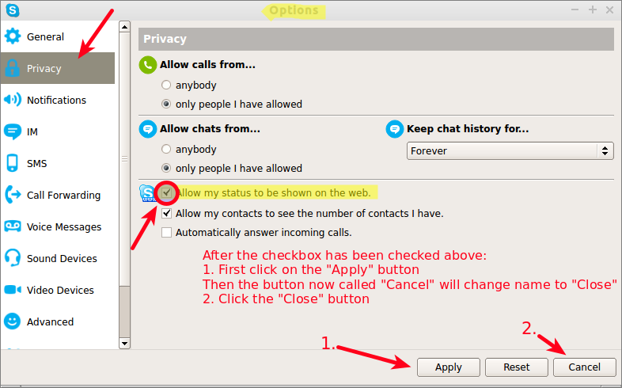
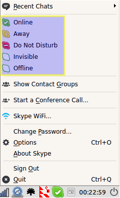

Reviewed by:
* Tord

# Empathizer Technical User Guide

## Setup

### 1. [Download Skype](http://www.skype.com/en/download-skype/) and create a Skype account

  * *Please note: Don't use a Microsoft or Facebook account, instead use a standard Skype account*
  * Set the user name to empathizer_{firstname}, for example: empathizer_tord
  * Give an email address to an email account that you check often and that you will continue to use

#### Windows 8

If you have Windows 8 it's important that you install the skype desktop version and not use the "Metro"/app version

This is because the new skype app in Windows 8 only support logins with Microsoft accounts and we use "classic" skype accounts for Empathy App. The desktop version can be downloaded here: [http://www.skype.com/go/getskype-full](http://www.skype.com/go/getskype-full)

### 2. Change to publically visible status

* The exact wording may vary since there are many different skype "clients" (programs) for different platforms. (For example on some of the clients it may say "options" and on others "preferences")

1. Go into Skype *options*
2. Then to *privacy*
3. Aactivate the checkbox for *"Allow my status to be shown on the web"*
4. Click on the "Apply" button to apply the changes
5. Click on the "Close" button to exit

#### Android

If you are using an Android phone you cannot change this setting from the Android skype client software. To fix this you instead need to login with the same account *on another platform* (for example Windows or Ubuntu) and change the settings there. These settings will be global but you need to log out and log back in on your Android phone for the changes to take effect. (As with the rest of the setup you only need to do this once)

Info about how to change status on Android [can be found here](https://support.skype.com/en/faq/FA12192/how-do-i-update-my-status-mood-message-and-profile-in-skype-for-android-tablet#1)

### 3. Register on the Empathy App website

1. Go to [https://www.empathyapp.org/wp-login.php?action=register](https://www.empathyapp.org/wp-login.php?action=register)
2. Register with your empathizer_{firstname} Skype name

## Using Skype

### Checking in

1. Start Skype
2. *If* you have another account that you are logged into by default: Log out of this account
3. Log in to your empathizer_firstname account

### Taking a call

1. You will hear skype calling you, click the green phone icon to answer
2. Once you are on a call change your status to "invisible" so that the next caller will be directed to a backup empathizer

### After a call

Collect call info (Skype name and the call length in minutes) and enter these into the form you can find on [the email form page](https://www.empathyapp.org/email-form/)

### End of shift

* Log out from your empathizer Skype account
* Make sure you have entered [the email form page](https://www.empathyapp.org/email-form/) for all the calls you had

## Howto

#### Changing the likelihood that you will be called

##### Background
There are many different statuses that can be set in skype and they (together with the order in the queue) help to determine which of the empathizers that will get the next call

This table displays who will be called when there are two empathizers in the call queue and emp2 is the "backup empathizer" in the call queue:

*emp1*\emp2->          | Offline | Invisible | Do not disturb | Away | Available
-----------------------|---------|-----------|----------------|------|----------
***Offline***          | No one  | emp2      | emp2           | emp2 | emp2
***Invisible***        | *emp1*  | *emp1*    | emp2           | emp2 | emp2
***Do not disturb***   | *emp1*  | *emp1*    | *emp1*         | emp2 | emp2
***Away***             | *emp1*  | *emp1*    | *emp1*         |*emp1*| emp2
***Online/Available*** | *emp1*  | *emp1*    | *emp1*         |*emp1*| *emp1*

###### Android phones

If you are using an Android phone you do not have this many options, only "Available" and "Invisible"

##### Changing the status

To change the status right-click on the skype icon in the lower-right corner. This will bring up a menu similar to this one:

And you can choose your status here

#### Taking a break

* Set Skype status to "do not disturb"
* Set Skype status to (for example) "online" when you get back

### Good to know

#### Skype phone app usage

Make sure that you take your phone number off the app, otherwise skype will attempt to call you if you are not online. You can do this easily by going to My Account, then changing your call forwarding option by taking your phone number out. 

#### If you have skype on multiple units

Please only be logged in on one unit at a time (for example don't use Skype with the empathizer account on both your desktop computer and your smartphone at the same time)

