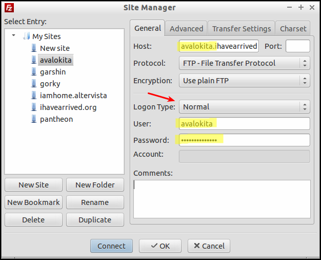
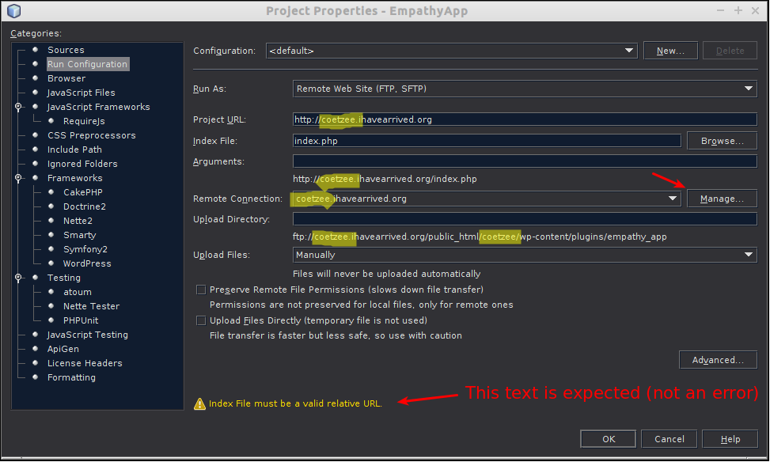
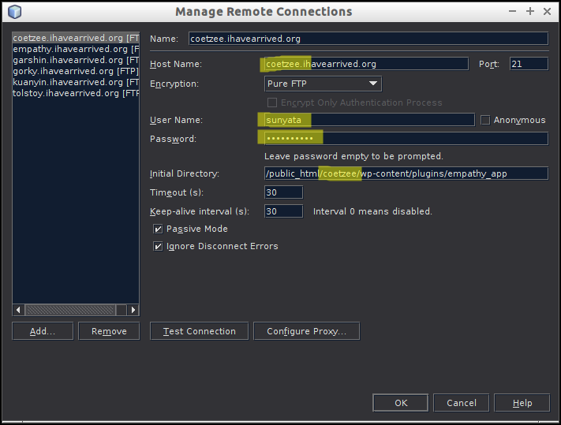
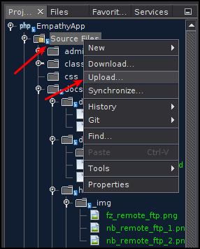
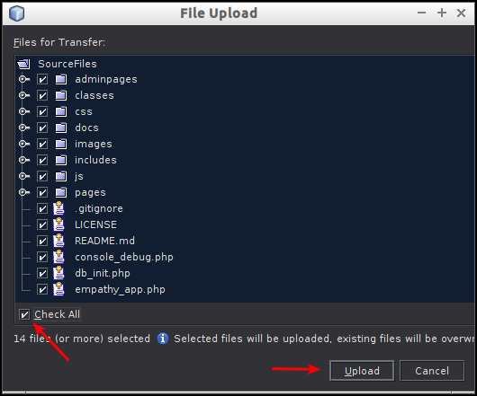

DocVer: 0.1


Prerequisites:
* A dev site created (normally done by the site mgr Tord), the steps for this part of the setup are listed in [this](setting-up-a-new-site.md) document


## FTP access

### 1. Getting an email with login/access info

You will recieve an email looking something like the one below. If you havn't please contact Tord (SunyataZero) at tord (dot) dellsen (at) gmail (dot) com

```
> Hi!
> I have now set up a remote dev site if you should need it at
> {subdomain}.ihavearrived.org
> 
> FTP access:
> User name: {subdomain}@ihavearrived.org
> Password: {ftp password}
> 
> Here's also an overview of the different subdomains we use:
> https://github.com/EmpathyApp/EmpathyApp/wiki/Remote-site-overview
> 
> 
> Some installation details from the wordpress install:
> 
> Path : /home/sunyata/public_html/{subdomain}
> URL : http://{subdomain}.ihavearrived.org
> Admin URL : http://{subdomain}.ihavearrived.org/wp-admin/
> MySQL Database : {db name}
> MySQL DB User : {db name}
> MySQL DB Host : localhost
> MySQL DB Password : {db password}
> Auto Upgrade : Disabled
> Automated Backups : Disabled
> Time of Installation : January 23, 2015, 12:17 pm
> 
> If you need access to the db please use the mysql login details from above to log in here:
> http://ihavearrived.org/sidu/
> 
> Kind Regards,
> Tord
```

You may also have recieved another email like this (if not the same info will be included in the email above):
```
> Username: h_seldon
> Password: {wordpress admin password}
> http://{subdomain}.ihavearrived.org/wp-login.php
```

In summary, you now have access to:
* An ftp account
* A Wordpress database
* A Wordpress admin login


### 2. Using the ftp login details to access the dev site

#### Example 1: Filezilla



#### Example 2: NetBeans

##### Setup



Clicking on "Manage" we get this window:



##### Uploading to remote site





